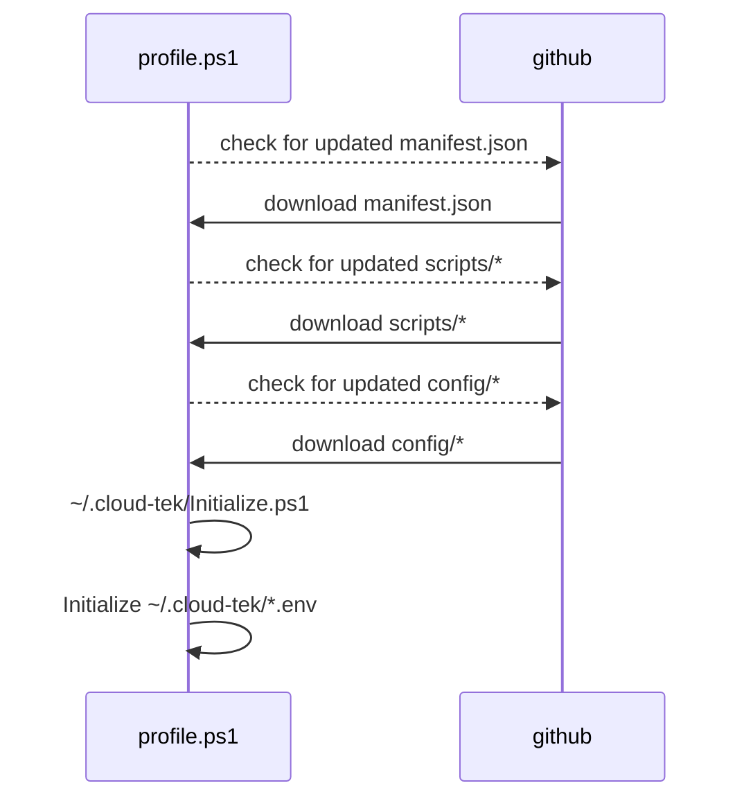

# dev-env

This repository was created using [cloud-tek/ops-repo-template](https://github.com/cloud-tek/ops-repo-template)



## Usage (MacOS / Linux)

- Install powershell
    - [MacOs](https://learn.microsoft.com/en-us/powershell/scripting/install/installing-powershell-on-macos?view=powershell-7.3)
    - [Linux](https://learn.microsoft.com/en-us/powershell/scripting/install/installing-powershell-on-linux?view=powershell-7.3)

- Ensure `~/.config/powershell/profile.ps1` is set to to the following content to enable the self-updating `dev-env`, using this 1 line pwsh command.

> **profile.ps1**
>
> ```pwsh
> Invoke-WebRequest -Uri "https://raw.githubusercontent.com/cloud-tek/dev-env/main/scripts/profile.ps1" -OutFile "~/.config/powershell/profile.ps1";
> ```
>
> The above needs to be executed in a powershell session. The profile will work for all subsequent PS sessions on your machine

## Usage (Windows)

TBA (not supported)